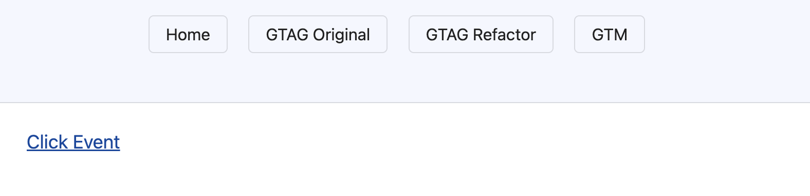
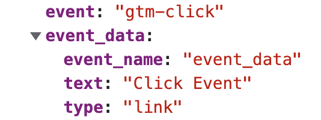
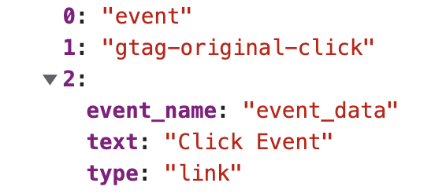
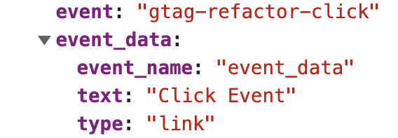

# Standalone Spike

This was created to figure out if it is possible to move from Google Analytics 4 (GA4 or GTAG) to Google Tag Manager (GTM) - and back again - and how tricky that would be.

## Something that sends events

In order to demonstrate the events being fired we need something to create them. We chose the easiest approach - a link. In-line with our current approach, the link has the event data on the element as a data attribute.

```html
<main>
  <a id="anchor" data-ga4='{"event_name":"event_data", "type":"link", "text":"Click Event"}' href="/dummy-url-one">Click Event</a>
</main>
```



## The existing GTM implementation

As we already were working on converting from Google Universal Analytics (UA) to GTM, we had a starting place and example code. It looks a bit like this...

```html
<script>(function(w,d,s,l,i){w[l]=w[l]||[];w[l].push({'gtm.start':
new Date().getTime(),event:'gtm.js'});var f=d.getElementsByTagName(s)[0],
j=d.createElement(s),dl=l!='dataLayer'?'&l='+l:'';j.async=true;j.src=
'https://www.googletagmanager.com/gtm.js?id='+i+dl;f.parentNode.insertBefore(j,f);
})(window,document,'script','dataLayer','GTM-XXXXXXX');</script>

<noscript><iframe src="https://www.googletagmanager.com/ns.html?id=GTM-XXXXXXX"
height="0" width="0" style="display:none;visibility:hidden"></iframe></noscript>

<script>
  window.onload = function (event) {
    var anchor = document.getElementById('anchor');
    anchor.addEventListener('click', function(event) {
      if (window.dataLayer) {
        var event_data = JSON.parse(event.target.getAttribute('data-ga4'))
        var data = { 'event': 'gtm-click', event_data };
        window.dataLayer.push(data);
      }
    });
  }
</script>
```

### Example event



## A GTAG implementation

Next, we wanted an exmple GA4(GTAG) example. After creating a GTAG property, we simply grabbed the tracking snippet given to us and added some familiar looking code to grab the event data and send it to the `dataLayer`.

```html
<script async src="https://www.googletagmanager.com/gtag/js?id=G-XXXXXXXXXX"></script>
<script>
  window.dataLayer = window.dataLayer || [];
  function gtag(){window.dataLayer.push(arguments);}
  gtag('js', new Date());
  gtag('config', 'G-XXXXXXXXXX');
</script>

<script>
  window.onload = function (event) {
    var anchor = document.getElementById('anchor');
    anchor.addEventListener('click', function(event) {
      var event_data = JSON.parse(event.target.getAttribute('data-ga4'));
      gtag('event', 'gtag-original-click', event_data);
    });
  }
</script>
```

### Example event



## A refactored GTAG implementation

At this point, we noticed this function...

```js
function gtag(){window.dataLayer.push(arguments);}
```

Looks a *lot* like our GTM event sending code. Surely, we don't need this function?

```html
<script async src="https://www.googletagmanager.com/gtag/js?id=G-XXXXXXXXXX"></script>

<script>
  window.onload = function (event) {
    var anchor = document.getElementById('anchor');
    anchor.addEventListener('click', function(event) {
      if (window.dataLayer) {
        var event_data = JSON.parse(event.target.getAttribute('data-ga4'))
        var data = { 'event': 'gtag-refactor-click', event_data };
        window.dataLayer.push(data);
      }
    });
  }
</script>
```

Interesting! this is now the same as our original GTM code.

### Example event



## Conculsion

We can make further refinements and refactorings of course. But, essentially it looks like switching between GTM and GTAG is simply a case of suppling the appropriate tracking snippet. The code remains the same!
